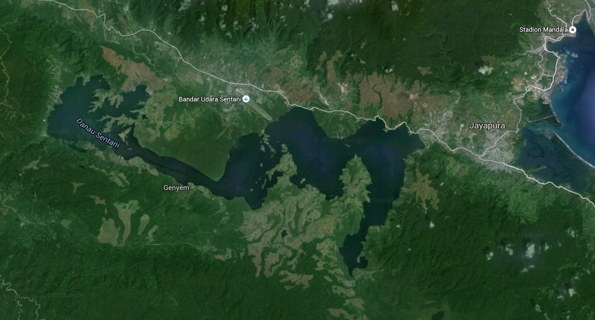
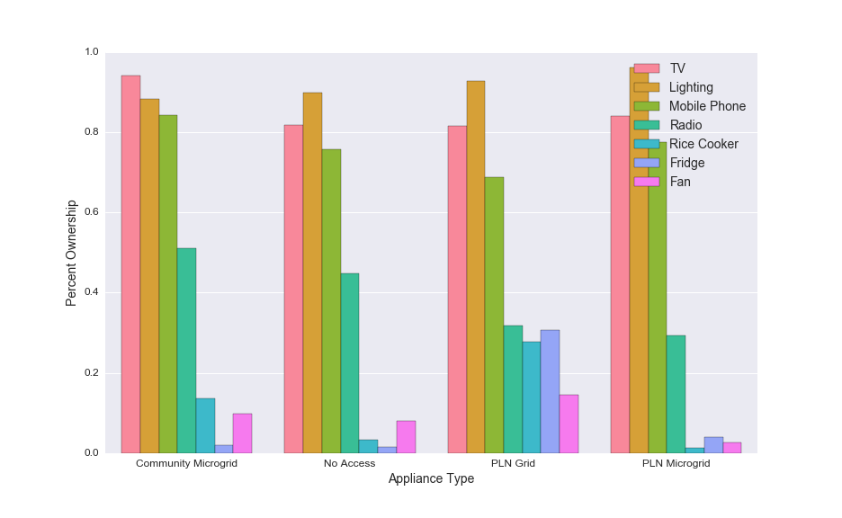
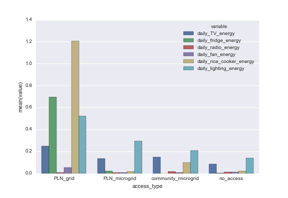
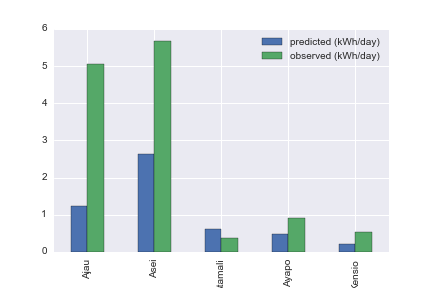

# Abstract

- new generation in under-served areas often too high
- we compare survey estimation to observed electricity use
- we observe differences in appliance ownership based on access type
- we observe differences in hourly reported use based on access type

# Introduction

## Global Topic

- global electricity access is poor
- many areas require private capital to install electricity
- part of problem is upfront investment cost
- due to perceived business risk, upfront capital is costly [@JaramilloReview2015]

## Oversizing

- generation is frequently allocated at levels that are too high
- oversized microgrids based on overestimated demand that cannot meet
    revenue targets contribute to this perception [@USAID2015]
- Schnitzer has shown the consequences of generators with excess
    capacity on microgrid operation [@Schnitzer2014]
- Schnitzer Haiti Thesis data can provide evidence
- quantify the level and frequency of generator mismatch
- to avoid excess capacity, systems must be sized appropriately
- accurate sizing requires accurate demand estimation

## Demand estimation informs sizing

- estimating demand in areas without access is challenging (citation)
- through more accurate appliance estimation, we may achieve more
    accurate energy estimation
- with more accurate energy estimation, a micro-utility can reduce
    the variance in revenue
- reductions in revenue variance should lead to lower-cost capital
    [@JaramilloReview2015]
- we explore methods for bottom up estimation of appliance ownership
    and compare to observed electricity consumption

## Contribution

- more accurate forecasting of appliance purchases, use, and resulting
    electricity demand can improve financial performance by improving
    the procurement of power generation equipment
- we use surveys of rural household appliance ownership and compare to
    observed electricity consumption to verify the accuracy of a
    bottom-up method

## literature review of rural energy forecast theory and results

- Schnitzer Thesis
- Paatero
- ASHRAE Fundamentals Ch. 19
- World Bank WPS4866

# Methods Overview

- We compare observed electricity consumption with a bottom-up estimation based on appliance survey data
- Collect survey data on current per household appliance ownership including hours of operation
- Extrapolate energy usage based on estimations of power
- Measure distribution of daily energy for measured villages
- Compare predicted to observed energy usage from metered villages

## Lake Sentani Description

<!-- TODO: decide if we are including village sizes -->

- The survey was designed and administered by Advancing Energy and Cenderwash University as part of an electrification effort in the Lake Sentani region
- The survey was designed to ask questions relevant to the electricity needs of the community
- 26 Villages were surveyed with varying degrees of energy access
- Electricity access among the surveyed households ranged from grid access to village-level access, to only household-level sources of energy
- We define four access types: grid, sponsored microgrid, community microgrid, no centralized
- Lake Sentani is an inland lake in Indonesia near the coastal city of Jayapura
- Many island communities
- Area is surrounded by some grid access
- Other areas are serviced by community or utility administered microgrids
- Survey carried out in Q3 and Q4 of 2014
- Basic data about the source of electricity and total number of structures was collected.
- The survey collected data on electricity use and assets for 1184 households
- The survey used the ODK platform which allows for the electronic collection of data from hand-held tablet devices
- The data was stored online using Ona

## Survey Basic Description

<!-- TODO: decide whether or not to break these out by access type -->
<!-- TODO: what notation should I use for village type or access type? -->
<!-- TODO: should I get down to only surveys with all valid appliance and usage questions? -->

- Households responded yes or no to questions on the ownership of lighting, television, radios, fans, rice cookers, and refrigerators.
- Not all households answered these questions, so our statistics on ownership omit some surveyed households.
- We tabulate the number of households with each type of electricity access since this is a common category for us to explore.
- $N_{h}$ is the total number of households present in the area of interest
- $N_{vos}$ is the number of surveys with valid appliance ownership responses
- $N_{vos} / N_{h}$ is the fraction with valid surveys
- Of the total households available in a given village, the percentage surveyed ranged from 45% to 75%

<!-- survey_counts.ipynb -->

Table: Number of surveys.
Percentage with Valid Surveys is the percentage of all households in each category that have complete responses for the appliance ownership questions.

|                     |   Households Present |   Valid Surveys |   Percentage with Valid Surveys |
|:--------------------|---------------------:|----------------:|--------------------------------:|
| PLN_grid            |                  660 |             568 |                        0.860606 |
| PLN_microgrid       |                  170 |             158 |                        0.929412 |
| community_microgrid |                   60 |              52 |                        0.866667 |
| no_access           |                  398 |             257 |                        0.645729 |

## Appliance Ownership

<!-- TODO: are these differences because of other issues can we visualize on map? -->

- We infer the proportion of the village households owning a given appliance category from our survey data questions on ownership.
- To investigate the differences in appliance ownership, we look at the differences in the percentage of households owning each surveyed appliance for villages of different access types.
- Since we are interested in differences in electricity usage across access types, we aggregate the household ownership by access type using a groupby operation.
- We observe the reported percentage of appliance ownership in each access type or village by summing the yes/no response and dividing by the number of respondents
- We assume that the population responding to surveys have similar ownership patterns to the non-respondents.
- We ask whether a household owns an appliance of type $h$ for several types of appliances
- $A_{h, i}$ is a 1 or zero variable for the presence of appliance type $i$ in surveyed household $h$
- $F_{i} = \frac{1}{N_{vos}} \sum_{h}^{N_{vos}} A_{h, i}$ is the fraction of households owning appliance type $i$ and $N_s$ is the number of households with valid appliance surveys
- We calculate $F_{i}$ over different samples like villages or access types

<!-- -->

## Appliance Ownership Results

- The figure shows our estimates of $F_{i}$ the percentage of ownership for each appliance type in each of the electricity supply categories.
- We observe over 70% ownership for TV, lighting, and mobile phone in all access types
- These are highly desirable services with modest energy requirements
- Surveys indicate these appliances are used in areas without central access suggesting high usage of household-level electricity generation, likely from small petrol generators.
- We observe higher ownership of rice cookers and refrigerators in areas with grid connections
- It isn't clear yet whether this is also a wealth effect
- Since these appliances require greater power and energy, we expect them in grid locations
- A key question is whether other regions, once electrified will purchase these items
- We observe higher radio ownership with in microgrid areas

# Bottom Up Electricity Estimation

- We use our survey instrument to estimate the electricity use by villages
- Information on the ownership of appliances and their use are combined with assumptions about the power level of appliances to form an estimate.
- We start by demonstrating patterns of ownership of appliances
- We then add information on the patterns of usage of appliances
- We combine these patterns of usage with assumptions and measurements of appliance power to create energy usage estimates
- In a later section, we will compare these energy usage estimates to the measured consumption.

## Appliance Usage

- To estimate the influence of electricity availability on the quantity of use of appliances, we asked households to report on the duration of appliance usage for each appliance.
- We observe the variation in hours per week of usage of each type of appliance through survey questions.
- We collect statistics on the hours per week that appliance use is reported
- We assume the population of non-responses has the same composition as the respondents
- We report for lighting, mobile phones, television, radio, refrigerators, fans, and rice cookers

<!-- what are the variations in appliance hours? -->
<!-- this needs elaboration in the supplemental material -->
<!-- see notebooks from feb 2016 -->

<!-- TODO: make a table of variables? -->

- We report hours for appliances among households owning that appliance
- $HD_{h, i}$ is the number of hours per day that appliance type $i$ in surveyed household $h$ is used for households that report owning appliance $i$.
- $WF_{h, i}$ is the number of times per week that appliance type $i$ in surveyed household $h$ is used for households that report owning appliance $i$.
- $HD$ and $WF$ are questions in the survey
- $HW_{h, i} = HD_{h,i} WF_{h,i}$ is the number of hours per week that appliance type $i$ in surveyed household $h$ is used where that appliance is owned.
- $NTD_{i}$ is the number of households reporting time data for each appliance
- $MHW_{i} = \frac{1}{NTD_{i}} \sum_h^{NTD_i} HW_{h,i}$ is the mean hours per week for each type of appliance.
- Note that the number of households computed in the mean is different for different appliances.

<!-- $N_{vts}$ is the number of surveys with valid appliance time usage responses -->
<!-- $NAO_{i}$ is the number of appliance owners for appliance type $i$. -->

- Figure shows differences in hourly use among access types
- Grid users report higher weekly hours for all appliances besides radios
- This suggests appliance usage is constrained by cost or availability of electricity
- The rice cooker hours don't seem correct, however, since 100 hours of use seems excessive.

## Electricity Estimates

<!-- TODO: am i certain that summing averages per appliance gives the overall? -->

- From these estimates of appliance prevalence and frequency and duration of use, we can estimate the average household energy use.
- We also estimate the power level of appliances and show them in Table X
- Multiplying the average power by the hours of use per day gives the energy per day
- $E_{h,i}$ is the daily energy per household for appliance type $i$
- $P_i$ is the assumed average power for appliance type $i$
- $F_i$ is the number of times per week appliance type $i$ is used
- $H_i$ is the number of hours per day, on days of use, that appliance $i$ is used
- $E_{h, i} = HW_{h, i} P_i$ where $P_i$ is the average energy per week of appliance type $i$ in household $h$.
- We assumed households owning the appliance but not answering usage questions did not use the appliances resulting in a slight underestimate.
<!-- TODO: do the calcs in the supplementary materials reflect this? -->
- From each of these appliance types, we can estimate the overall energy usage per household.
- We calculate the energy use per appliance type for each household and then average over households for each appliance type to get the average energy use per overall household for each appliance type.
- By summing over these appliance types, we can estimate the overall electricity use
- From this, we create an estimate of the energy per day consumed if all appliances working and grid has 100% uptime
- From this method we can estimate the total energy use as well as the contribution of each type of appliance
- Households not responding are given zero consumption for that appliance
- Averaging all these values gives the per household consumption for each appliance type
- The sums below are over a access type or village of interest

$$ HE = \frac{1}{N_h} \sum^{N_h}_h \sum^{N_{app}}_i WE_{i,h} $$

Table: Estimated average power for each of the surveyed appliance classes.

|            |   TV |   fan |   fridge |   lighting |   radio |   rice_cooker |
|:-----------|-----:|------:|---------:|-----------:|--------:|--------------:|
| power (kW) | 0.04 |  0.05 |      0.1 |       0.05 |    0.01 |          0.35 |

<!-- P(appliance ownership|survey respondent) = P(appliance ownership|non&#45;respondent) -->
<!-- We perform an imputation where if a household reported owning appliance but did not report the hours of use, we assumed the hours were the average of the other responses -->
<!-- $HWV_{i} = MHW_{i} F_{i} N_{v}$ is the number of hours of appliance use of type $i$ in village $v$. -->
<!-- $F_{i}$ is calculated from the number of appliance owners and the total number of households. -->

<!-- EDITING: you are here -->

<!-- TODO: do we extrapolate the findings from one village to others? -->
<!-- TODO: do we expect behavior variation inside the categories -->
<!-- TODO: make notation below consistent with the above -->

<!-- incorporate existing notes from lab book -->

<!-- TODO: do I need to do this if my averaging already accounts for this? -->

- To extend these statistics to other populations, we extrapolate given the number of households and the proportion of appliance ownership there.
- To estimate the village energy, we calculate the average $E_{d, i}$ for households owning that appliance type and extrapolate for the whole village.

<!-- fix this notation: -->

- We observe two contributions to variation
    - Patterns of appliance ownership
    - Patterns of appliance usage
- If these villages are similar in other respects, we expect the locations with less reliable electricity to change their behavior to be similar to the grid when reliable electricity arrives.
- Latent demand has two factors, appliance purchase and service increase

## Variation in Energy Use Results

<!-- TODO: does this persist if we normalize for ownership? -->

- Survey responses indicate more appliance use in grid connected areas.
- This reveals a measure of latent demand
- We observe appliance energy variation by access type
- In all areas, TV and lighting energy are a significant fraction of the demand.
- In grid locations, a high amount of energy from refrigerators and rice cookers is also observed.

# Electricity Consumption Measurements

<!-- TODO: explain and document how we determine the number of households connected -->

- We observe electricity consumption by village
- Electricity consumption varies by connection type
- We observe 85% or greater uptime for grid connected villages
- We observe 15% to 25% uptime for microgrids
- We estimate daily use by only measuring the days with a full day of electricity usage

Table: Average daily energy on grid when energy available for the entire day.

|         |   mean kWh per day |   mean kWh per day per household |   median kWh per day |
|:--------|-------------------:|---------------------------------:|---------------------:|
| Ajau    |           611.082  |                         5.05026  |            623.048   |
| Asei    |           186.858  |                         5.66238  |            213.209   |
| Atamali |            15.3702 |                         0.384255 |             16.7874  |
| Ayapo   |            95.3872 |                         0.926089 |             97.4594  |
| Kensio  |            10.7819 |                         0.539094 |              9.85263 |

# Comparison of predicted and observed electricity use

- We focus on the five villages in our survey that also have electricity data

- the appliance estimations underestimate the energy use observed on these grids
    - constraints on electricity availability should lead to overestimation
    - ownership estimation errors
    - number of lighting points isn't observed in survey
    - unobserved or recently acquired appliances since survey
    - variance in power levels

# Discussion and Conclusion

## Latent demand

- Latent demand has multiple sources
- The delivery of reliable electricity will stimulate appliance purchase
- The delivery of reliable electricity will increase use in some
    appliances
- this forecasting comparison is valuable to practitioners
- refining estimates will improve revenue and cost of capital long term

## Future work

- longitudinal observations will allow us to observe the growth of
    appliance ownership through acquisition and the accompanying growth
    in electricity use
- estimates of electricity increase from latent demand
- signals in electricity use that signal latent demand increases
